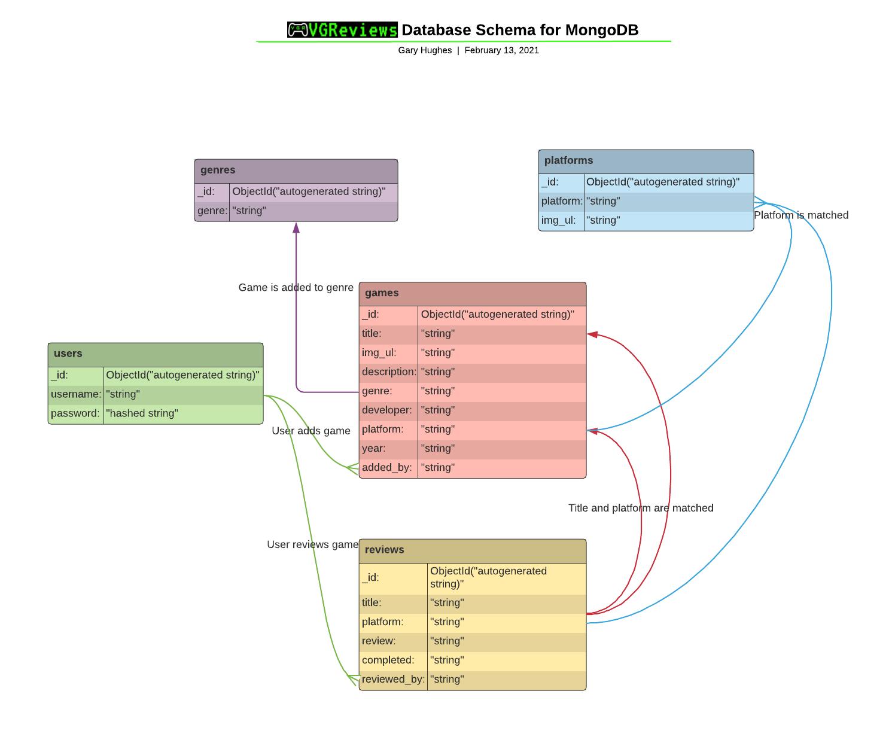

# [Video Game Reviews](https://vgreviews-project.herokuapp.com/)

## [Code Institute](https://codeinstitute.net/) Milestone Project 3

### View the live VGReviews Heroku app, click [**>>HERE<<**](https://vgreviews-project.herokuapp.com/)


---

## **Summary**

VGReviews is a video game review website that allows any user to generate game review content and 
also, edit and delete their published reviews.

### **Introduction**

If your're looking for your next game to play or enjoy writing about your gaming journey. This is the 
app for you. 

Users can register an account, browse games and reviews, add your own and edit your 
content.

At VGReviews we don't make a quick judgement of a game based on a review score. You might be 
missing out on a good game. That's why we encourage our writers to be as honest and thorough as
possible to bring you the best reviews possible.

As gamers like yourself, we know review scores for a single game can be found anywhere within the 
scale of 1 to 10. Content is king and we feel it's no different when it comes to game reviews. 
The content you read will help you to make the best decisions.

---

## **UX (User Experience)**

- Does this fit my user's needs?
- Does the user like my website?
- Does the user like being at my website?
- Is this a website a user might want to return to in the future?

These are all questions I asked myself throughout the UX design process.

### **User Goals and Expectations**

#### Goals for the main users:

- Have an easily accessible game review website to share their gaming experiences and recommendations.
- Have the ability to add reviews for existing games and add new games for reviewing if required.
- Have an enjoyable experience discovering new games and including views and opinions on existing games they have 
  already played.

#### Goals as the developer

- Demonstrate a solid understanding and utilization of Python, MongoDB and Heroku.
- Build a friendly and useful game review web app.
- Make the website easy to use and navigate around, providing a positive user experience.
- Build upon my portfolio with another great project.
- Increase the database usage with new users and content.

### **User Stories**

- As a new visitor to this website, I want to experience easy navigation around the site and find reviews quickly from the homepage.
- As a new visitor, I would like to Quickly recognize any interactive elements and build an understanding of how one thing
  leads to another so the website flows well.
- As a new visitor I want to find where I can easily register an account.
- As a new visitor, I want responsiveness and a consistent design so I can enjoy viewing the site on a range of devices and screen
  sizes and not be confused by any unnecessary, drastic changes.
- As a new visitor, I want to browse posted content based on categories, whether it be platform name, genre, 
  game title or other related keywords.
- As a new visitor, I would like to Quickly recognize any interactive elements and build an understanding of how one thing
  leads to another so the website flows well.
- As a new visitor, I want responsiveness and a consistent design so I can play the game on a range of devices and screen
  sizes and not be confused by any unnecessary, drastic changes.
- As a registered user I want to quickly find how to login and post a review with ease.
- As a registered user I want to easily add, edit and delete reviews with a continuous flow.
- As a registered user I want to see a gallery of all the reviews I have posted in one place.
- As a registered user I want to have my own account page with a range of functionality.
- As a returning user I want to see content presented/sorted alphabetically or newest first, or even have the option to choose.
- As an administrator, I want to easily moderate user-posted reviews and games.
- As an administrator, I want to manage platform and genre categories using 'CRUD' (Create Read Update Delete).
- As a developer, I want to have options for projects I can continue to build on with updates introducing enhancements and
  additions in aesthetics, gameplay, sound, and so on as I continue to gain experience and expand on my skills.

### **Design Choices**

#### Colour Scheme

 `#000000`
 `#1d800a`
 `#39ff14`
 `#9cff8a`
 `#ffffff`
 `#404040`
 `#808080`
 `#c0c0c0`

- Black and white are the dominant/primary colours throughout the website, mainly for nav bars, backgrounds and text. 
- Shades of green are the contrasting accent colours, used in the logo, some headings, icons, borders and buttons.
- The last colours are the contrasting neutrals to use where necessary.

#### Typography

- 'Press Start 2P' is the font I have chosen to use for headings and is part of the logo.
- 'Play' is the font I have chosen to use for all other text.
- These fonts are imported via the head element of an HTML file from Google Fonts.
- Cursive and sans-serif are the fallback fonts if for some reason the above fonts can't be imported into the site 
  correctly.
- As the font names suggest, they are both very appropriate to use for a gaming website, are generally very popular 
  in the developer world and are also very easy to read and attractive.

#### Icons/Imagery

- Font Awesome was used to import icons into the website.
- The background images I chose for this website fit the gaming theme perfectly.
- In conclusion, I feel all the icons and imagery in combination with the colour scheme and typography produce a 
  modern and attractive looking design.

### **Strategy**

The focus of this project is on using the knowledge I have learned of Python to build a responsive application, in 
this case, a game review website to demonstrate to anyone my capabilities in Python alongside HTML5 and CSS3, and 
jQuery.

### **Scope**

My website's main target users are both casual and passionate gamers. The scope of this app is to provide a place 
where any gamer, with any platform or console preference, can share their honest opinions on the games they have 
played, or read those other users as themselves have posted.

My app caters to the basic needs of an administrator by including a variety of tools in order to moderate user 
posted content and provide updates to the website with more gaming platforms, genres or games.

My project provides every user tier 'CRUD' 'CRUD' (Create Read Update Delete) functionality on any of their own 
data added to the website, with tools to search, sort and make any edits.

I bucket my features into separate lists by priority:

1. 'Will Do' features had to be completed by my given submission deadline for this project. These have one or both of
   the following characteristics:
   _ Upper bound: Meet the requirements of a project based on the project specifications.
   _ Lower bound: Show as much prowess in course material as possible. Show that I can use the different facets of
   each language (HTML/CSS/JS/Python).
2. 'Stretch Goals' are features to try to implement if I had time left at the end of the project. These should be
   relatively quick and easy to implement but only if the above features have been completed.
3. 'Won't Do' features are features I won't get done before the project deadline but are features I may want to work
   on in the future and include in future updates.

### **Structure**

I knew I had to limit what functions and mechanics I wanted to include if I was to finish this project by the final
submission deadline. WEBSITE LAYOUT/PAGE DESCRIPTIONS HERE

### **Skeleton**

#### **Wireframes**

Listed below are the mobile, tablet and desktop wireframes for my website, created using the Balsamiq Wireframes
application. These wireframes were produced to show the planned differences in appearance between large and small
screen sizes, but please note that they do not reflect a 100% replicated result of my website and were only used
as an original concept design to get the layout of each part or a particular feature of my website started.

- TO BE ADDED IN FUTURE

---

## **Features**

### **Current Features**

- Responsiveness across all device and screen sizes using the Materialize Grid system and CSS media queries makes 
  the website easily accessible and simple to navigate.
- A user-friendly interface.
- Attractive, minimalistic design with visuals and information presented clearly and concisely.
- Easy to read fonts.
- Fixed navigation bar visible across all pages, including menu dropdowns and brand logo always linking back to the 
  landing page.
- Interactive buttons for seamless navigation.
- Carousel.
- Forms for registering, login and adding/editing reviews, games, genres and platforms. These forms use input fields, 
  text area fields, selection dropdowns and buttons for submitting/saving changes to the database and user accounts.
- Modals for delete confirmation.
- Search bars allow the user to search for reviews and games by keywords using text index searching.
- User Accounts.
- 404 Page.

- TO BE UPDATED IN FUTURE

### **Future features/improvements to be implemented**

- Integrate bookmarking of reviews.
- Add text formatting to add/edit review forms.

---

## **Information Architecture**

### **Chosen Database**

I chose the NoSQL database, MongoDB for this particular project.

### **Database Schema**



#### Collections

As you can see above, the VGReviews database on MongoDB features 5 inter-related collections:

> **Note**: All collections contain the "_id" key with an autogenerated ObjectId string value.

    * The genres collection - contains the key "genre" (genre name) with a string value.

    * The platforms collection - contains the keys "platform" (platform name) and "img_url" with string values.

    * The games collection - contains the keys "title" (game name), "img_url", "description", "genre", "developer" 
      (game developer name), "platform", "year" (year of game release on platform), and "added_by" (added by user) 
      all with string values.

    * The reviews collection - contains the keys "title" (game name), "platform", "review" (user-generated review 
      text), and "completed" (Does the user feel they have completed the game?) all with string values.

    * The users collection - contains the key "username" with a string value and the key "password" with a string 
      value that has been hashed and salted by Werkzeug.

---

## **Technologies Used**

### **Languages**

- [HTML5](https://en.wikipedia.org/wiki/HTML5) - Used to build the basic layout of the website.
- [CSS3](https://en.wikipedia.org/wiki/Cascading_Style_Sheets) - Used for styling and formatting the base HTML code and personalise my website.
- [JavaScript](https://www.javascript.com/) - Enhances user experience by adding functionality and interactivity to the website.
- [Python](https://www.python.org/) - Handles data provided by the database.
- [Jinja](https://jinja.palletsprojects.com/en/2.11.x/) - Handles the frontend display of data provided by the backend database in addition to HTML code.

### **Frameworks**

- [Flask](https://flask.palletsprojects.com/en/1.1.x/) - A web app framework used to provide libraries and packages 
  for importing to construct and render page templates.

- [Materialize CSS](https://materializecss.com/) - Materialize CSS was used to assist with some of the structurings, 
  responsiveness and styling of the website using grid functionality and design templates such as navigation bars, 
  forms, carousels and parallax.

### **Tools, Libraries, Editors and Version Control**

- [MongoDB](https://en.wikipedia.org/wiki/MongoDB) - MongoDB was used to store the database collections of documents 
  used in my project.

- [Werkzeug](https://werkzeug.palletsprojects.com/en/1.0.x/) - Werkzeug is used with Flask to make user authentication 
  more secure by utilizing various methods of hashing and salting passwords.

- [RandomKeygen](https://randomkeygen.com/) - Random Key Generator provides Fort Knox Passwords for password security.

- [pip](https://pip.pypa.io/en/stable/) - pip is the software package installer/manager for Python.

- [PyMongo](https://pymongo.readthedocs.io/en/stable/) - PyMongo is a Python distribution containing tools for 
  working with MongoDB, and is the recommended way to work with MongoDB from Python.

- [Google Fonts](https://fonts.google.com/) - Google Fonts were used to embed and link the 'Press Start 2P' and 'play' 
  fonts into the HTML. It was pointless importing them into the CSS file as the base.html file extends all other HTML 
  files with the required head tags.

- [Font Awesome](https://fontawesome.com/) - Font Awesome was used to provide the icons throughout the website for 
  aesthetic and UX design purposes. Icons give the user additional context from the first glance.

- [jQuery 3.5.1](https://jquery.com/) - jQuery comes as part of Materialize to make responsive components and is 
  included at the end of the body tags within the base.html file to ensure the correct running of HTML and CSS.

- [Git](https://git-scm.com/) / [Gitpod](https://www.gitpod.io/) - Git was used for version control by utilizing 
  the Gitpod IDE terminal to commit files to Git and push them to GitHub. Gitpod was the primary development tool 
  for the building and maintenance of the website.

- [GitHub](https://github.com/) - GitHub is used to store the project's code within a repository including all 
  previous versions or commits of the project after being pushed from Gitpod and can be used to host the deployed 
  website for public viewing.

- [Heroku](https://en.wikipedia.org/wiki/Heroku) - Heroku is the app platform this project is deployed to for public 
  viewing.

- [Lucidchart](https://lucidchart.com/) - I used Lucidchart to create the database schema for MongoDB.

- [Coolors](https://coolors.co/) - Coolors was used to quickly get 'in-between' colours and relative hex codes.

- [Adobe Illustrator](https://www.adobe.com/uk/products/illustrator.html) - Adobe Illustrator was used for testing 
  colour and shading compatibility with my chosen colour scheme and tweaking if desired. It is also used for 
  cropping and scaling images.

- [Balsamiq Wireframes](https://balsamiq.com/wireframes/) - I'm using the Balsamiq Wireframes desktop application to 
  create all my [wireframes]() during the design process.

- [tiny jpg](https://tinyjpg.com/) & [tiny png](https://tinypng.com/) - These websites were used to compress the 
  images used throughout the website to reduce data size, decreasing load times without sacrificing the integrity 
  or quality of the original images.

- [Favicon Converter](https://favicon.io/favicon-converter/) - This Favicon converter was used to create the favicon 
  based on my brand logo, to be displayed on the browser tab and bookmarks bar.

- [Grammarly](https://www.grammarly.com/) - Grammarly is used to reduce grammar errors.

- [Google Chrome DevTools](https://developers.google.com/web/tools/chrome-devtools) - The Chrome DevTools were used throughout
  the building, testing and debugging of the website to quickly see the result of any changes made to any code via visualization
  in a live browser tab and/or the developer console.

- [Google Lighthouse](https://developers.google.com/web/tools/lighthouse/?utm_source=devtools) - Google Lighthouse was used for
  website auditing. This addon of DevTools can generate a report of each web pages performance, accessibility, best practices
  and SEO to aid in the testing and improvement of my website.

- [Autoprefixer CSS](https://autoprefixer.github.io/) - Autoprefixer was used to help with making the CSS code compatible and
  valid for all internet browsers as much as possible.

- [Am I Responsive Design?](http://ami.responsivedesign.is/) - This web tool was used to generate screencaps of my website at
  different viewport sizes to form a static demo presentation of my website's responsiveness as can be seen towards the top of this
  document.

---

## **Testing**

My process of testing includes:

- Testing my user stories as set out in the UX section.
- Validating all custom HTML, CSS and JavaScript files.
- Reviewing website compatibility on different browsers and devices.
- Reviewing design responsiveness from custom mobile screen sizes of 320 x 480px to desktop 4K resolutions in DevTools.
- Making sure all links function correctly.
- Getting my partner to review my website at different developmental stages and the completed product across multiple
  device sizes for feedback and to point out any obvious bugs or issues with her experience.

A typical instance of testing would involve the following:

- Open the website on the different web browsers and manually test all links.
- Open dev tools for testing design elements on mobile and tablet screen sizes.
- Login as admin user for testing.
- Login as regular user for testing.

My website is to be tested on the latest popular web browsers including:

- Google Chrome
- Mozilla Firefox
- Microsoft Edge
- Apple Safari
- Microsoft Internet Explorer
- Amazon Silk

I'm using the following physical devices for development and testing:

- AMD Ryzen 7 2700X PC running Windows 10, Chrome, Firefox and Edge browsers on two monitors; 1920x1200px and 2560x1440px natively.
- Apple iPhone 6S and SE running Safari browser.
- Laptop running Chrome, Internet Explorer and Edge browsers.
- Amazon Fire HD tablet running Silk browser.

- TO BE UPDATED IN FUTURE

The following validators were used to validate all of the HTML, CSS and JavaScript files that make up this project, to
ensure there are no syntax errors in the project code.

- HTML - [W3C Markup Validation Service](https://validator.w3.org/) - Only Jinja templating produces errors - safe to ignore.
- CSS - [W3C CSS Validation Service](https://jigsaw.w3.org/css-validator/) - Value Error : font-size Parse Errors are all safe to ignore.
- JavaScript - [JSHint Validator](https://jshint.com/) - No errors.
- Python - [PEP8 online](http://pep8online.com/) - All right.

- TO BE UPDATED IN FUTURE

### **User Story Testing**

- Clear login/register buttons are visible upon users entering the website.
- Login and register links are included in the nav meanu and displays 'logout' and the user's Username if they are logged in.
- As the same navigation is presented across every page of the website to a returning user, currently logged out, 
  the user can login/register from any page.
- If a user is logged in, the button will display 'logout' and the user's Username.
- The user is redirected to their account page that contains a button to add a review or game.
- Once the user has clicked on the login button, they are directed to the login page, where there is a link to the 
  account registration page.
- Validation is included for inoput fields to let the user know if what they have entered in a text field is valid 
  through colour formatting.
- An instantly recognisable info icon with tooltip lets the user know how many characters are required and which 
  characters can be used.
- Success and error messages are flashed between the navbar and main content of the page depending on the result.
- When a user is logged in, an add review button is visible to them upon first view of the website.
- The add review link is always accessible to the user via the nav menu while they are logged in.
- When a registered user visits the reviews page, an 'Add Review' button is presented under the search bar.
- When the user clicks on 'Add Review', they are directed to the add review page which supplies them with a form with 
  text input fields to fill in.
- Once the user has added a review, the user is redirected to the My Reviews page, where they can see their posted review(s).
- TO BE UPDATED IN FUTURE

### **Bugs Encountered**

- TO BE UPDATED IN FUTURE

---

## **Deployment**

### **Deploying to Heroku **

The project was connected to Heroku using automatic deployment from my GitPod repository, using the following steps...

> **Note:** Before following the below steps ensure you have already created your new repo in Github and set up an env.py file to store your sensitive data. (Further details on adding an env.py file below)

1. In the terminal create requirements.txt and Procfile files by typing the commands below:
   - $ pip3 freeze --local > requirements.txt

   - $ echo web: python app.py > Procfile

   > **Note:** 
The Procfile must be assigned a capital P.

2. Add, commit, and push these files to GitHub.

3. Log in (or Register) to [Heroku](https://www.heroku.com/) and from your dashboard click 'new' > 'create new app'.

4. Enter your unique 'App name' and choose your local region, then click 'Create app'.
   > **Note:** 
 The app name must all lowercase, and '-' to be used instead of spaces.

5. From the Heroku deploy tab, select the Deployment method 'GitHub'.

6. On the 'Connect to GitHub' section make sure your GitHub profile is displayed then add your repository name and click 'Search'.

   > **Note:** 
This is the name of your repo in GitHub. It is good practice to use an identical name for your Heroku app.

7. Your repo should now be displayed below, click 'Connect' to connect to this app.

8. Go to the Settings tab on Heroku, scroll to the 'Config Vars' section, and click 'Reveal Config Vars'. 

   Enter variables (key and value) contained in the env.py file. The keys are listed below and values are inputted by the user.
    - IP = 0.0.0.0
    - PORT = 5000
    - SECRET_KEY = [Your chosen Secret Key]
    - MONGO_URI = mongodb+srv://<username>:<password>@<cluster_name>-qtxun.mongodb.net/<database_name>?retryWrites=true&w=majority
    - MONGO_DBNAME = [Chosen MongoDB name]

9. Push requirements.txt and Procfile to the repository.

10. Go to the Deploy tab on Heroku and under the Automatic deployment section, click 'Enable Automatic Deploys'. Then under Manual deploy click 'Deploy Branch'.

   - Heroku will now receive the code from GitHub and start building the app using the required packages.
   - Once built you will receive the message 'Your app was successfully deployed' and you can click 'View' to launch your new app.

        > **Note:** 
        In Manual deploy dropdown 'master' is selected'

### **Accessing code**

Follow the steps below if you are wanting to propose changes to the project or to use the project as a starting point for your own idea.

- **Forking the GitHub Repository**

  Forking allows you to create a copy of the original repository and propose changes to the repository owner via a pull request.

  1. Log in to GitHub and locate the GitHub Repository.

  2. At the top of the Repository (not top of page) just above the "Settings" button on the menu, locate the "Fork" button.

  3. You should now have a copy of the original repository in your GitHub account.

- **Making a Local Clone**

When you clone a repository, the repository is copied on to your local machine.

1. Log in to GitHub and locate the GitHub Repository.
   - VGReviews repository can be found [here](https://github.com/Gazroh87/vg-reviews)

2. Under the repository name, click the "download code" option.   

3. To clone the repository using HTTPS, under "Clone with HTTPS", copy the link.   

4. Open Git Bash

5. Change the current working directory to the location where you want the cloned directory to be made.

6. Type git clone, and then paste the URL you copied in Step 3.

    ```
    $ git clone https://github.com/YOUR-USERNAME/vg-reviews.git
    ```

7. Press Enter. Your local clone will be created.

      Now, you have a local copy of your fork of the VGReviews repository.

    > **Note:** The repository name and output numbers that you see on your computer, representing the total file size, etc, may differ from the example I have provided above.

8. Add an env.py file to your workspace to include your environment variables (more details below).

   > **Note:** Contact the site owner if you want more information on the environment variables that have been included.

**Creating env.py file** 

1. Add a env.py file to store environment variables:
   - Import os 
   - os.environ.setdefault("IP", "To be added by user") 
   - os.environ.setdefault("PORT", "To be added by user") 
   - os.environ.setdefault("SECRET_KEY", "To be added by user") 
   - os.environ.setdefault("MONGO_URI", "To be added by user") 
   - os.environ.setdefault("MONGO_DBNAME", "To be added by user")

    > **Note:** I used [RandomKeygen.com](https://randomkeygen.com/) to get my secure SECRET_KEY password. A SECRET_KEY is required when using the flash and session functions of Flask.

 2. Create a file named .gitignore and include env.py to ensure this file is never pushed to GitHub.
    > **Note:** The env.py mustn't be tracked as any GitHub user can access your confidential data.

---

## Credits

### Code

- [Heroku](https://en.wikipedia.org/wiki/Heroku) - Heroku's excellent deployment system was used to supply the 
  website for public viewing, thanks to it's connection to gitpod.
- [MDN Web Docs](https://developer.mozilla.org/en-US/docs/Web) - Referenced for best practices for lists and images, 
  as well as the smooth scrolling functionality.
- TO BE UPDATED IN FUTURE

### Content

- [RandomKeygen](https://randomkeygen.com/) - Random Key Generator provides Fort Knox Passwords for password security.
- [Font Awesome](https://fontawesome.com/) - Font Awesome was used to provide the icons throughout the website for 
  aesthetic and UX design purposes. Icons give the user additional context from the first glance.
- [Materialize](https://materializecss.com/) - Materialize CSS, components and JavaScript were used throughout the website.
  These include the Materialize Grid system, helpers, buttons, cards, navigation, carousel, dropdowns, modals, 
  parallax, and tooltips.

### Media

- - [Favicon Converter](https://favicon.io/favicon-converter/) - This Favicon converter was used to create the favicon 
  based on my brand logo, to be displayed on the browser tab and bookmarks bar. Filepath is static/favicons/favicon.ico
- TO BE UPDATED IN FUTURE

### Useful information sources

- HTML/CSS/JavaScript - [w3schools](https://www.w3schools.com/)
- CSS - [CSS-Tricks](https://css-tricks.com/)
- JavaScript - [Developer Mozilla](https://developer.mozilla.org/en-US/docs/Web/JavaScript)

### Special thanks / Acknowledgements

- Thanks to Mentors for their knowledge and support.
- Thanks to Code Institute and Tim Nelson for giving me the knowledge, skills and the Mini Project template 
  presented during the course for help in getting started and completing this project.
- Thanks to Code Institute's tutors for help and support with completing challenges.
- Thansk to Code Institute's Slack community for providing advice and support.
- Thanks to my family for all their support and encouragement with the project.

Thanks for viewing my project/website.

---

## Disclaimer

This project was created for educational purposes only, for submission to the Code Institute Full Stack Software 
Development Course for DCD Milestone 3 project grading.