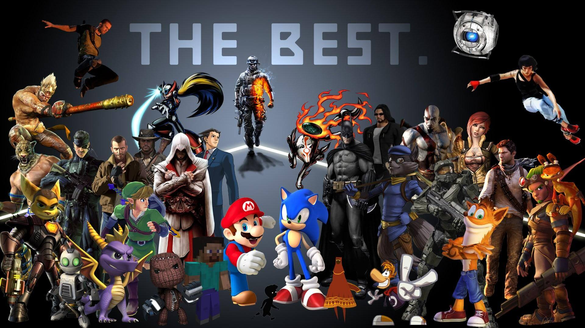

# [Video Game Reviews](https://vgreviews-project.herokuapp.com/)

## [Code Institute](https://codeinstitute.net/) Milestone Project 3

### View the live VGReviews Heroku app, click [**>>HERE<<**](https://vgreviews-project.herokuapp.com/)

---

## **Summary**

VGReviews is a video game review website that allows any user to generate game review content and 
also edit and delete their published reviews.

### **Introduction**

If your looking for your next game to play or enjoy writing about your gaming journey. This is the 
app for you. 

Users can register an account, browse games and reviews, add your own and edit your 
content.

At VGReviews we don't make a qucik judgement of a game based on a review score. You might be 
missing out on a good game. That's why we encourage our writers to be as honest and thorough as
possible to bring you the best reviews possible.

As gamers like yourself we know review score for a single game can be found anywhere within the 
scale of 1 to 10. Content is king and we feel it's no different when it comes to game reviews. 
The content you read will help you to make the best decisions.

---

## **UX (User Experience)**

- Does this fit my user's needs?
- Does the user like my website?
- Does the user like being at my website?
- Is this a website a user might want to return to in the future?

These are all questions I asked myself throughout the UX design process.

### **User Goals and Expectations**

#### Goals for the main users:

- TO BE ADDED IN FUTURE

**User expectations:**

- TO BE ADDED IN FUTURE

#### Goals as the developer

- TO BE ADDED IN FUTURE

**Developer expectations:**

- TO BE ADDED IN FUTURE

### **User Stories**

- As a new visitor to this website I want to experience easy navigation around the site and find reviews quickly from the homepage.
- As a new visitor, I would like to Quickly recognize any interactive elements and build an understanding of how one thing
  leads to another so the website flows well.
- As a new visitor I want to find where I can easily register an account.
- As a new visitor, I want responsiveness and a consistent design so I can enjoy viewing the site on a range of devices and screen
  sizes and not be confused by any unnecessary, drastic changes.
- As a new visitor, I want to browse posted content based on categories, whether it be platform name, genre, 
  game title or other related keywords.
- As a new visitor, I would like to Quickly recognize any interactive elements and build an understanding of how one thing
  leads to another so the website flows well.
- As a new visitor, I want responsiveness and a consistent design so I can play the game on a range of devices and screen
  sizes and not be confused by any unnecessary, drastic changes.
- As a registered user I want to quickly find how to login and post a review with ease.
- As a registered user I want to easily add, edit and delete reviews with a continuous flow.
- As a registered user I want to see a gallery of all the reviews I have posted in one place.
- As a registered user I want to have my own account page with a range of functionality.
- As a returning user I want to see content presented/sorted alphabetically or newest first, or even have the option to choose.
- As an administrator I want to easily moderate user posted reviews and games.
- As an administrator I want to manage platform and genre categories using 'CRUD' (Create Read Update Delete).
- As a developer, I want to have options for projects I can continue to build on with updates introducing enhancements and
  additions in aesthetics, gameplay, sound, and so on as I continue to gain experience and expand on my skills.

### **Design Choices**

#### Colour Scheme

 `#000000`
 `#1d800a`
 `#39ff14`
 `#9cff8a`
 `#ffffff`
 `#404040`
 `#808080`
 `#c0c0c0`

- Black and white are the dominant/primary colours throughout the website, mainly for nav bars, backgrounds and text. 
- Shades of green are the contrasting accent colours, used in the logo, some headings, icons, borders and buttons.
- The last colours are the contrasting neutrals to use where necessary.

#### Typography

- 'Press Start 2P' is the font I have chosen to use for headings and is part of the logo.
- 'Play' is the font I have chosen to use for all other text.
- These fonts are imported via the head element of an HTML file from Google Fonts.
- Cursive and sans-serif are the fallback fonts if for some reason the above fonts can't be imported into the site 
  correctly.
- Like the names suggest, they are both very appropriate to use for a gaming website, are generally very popular 
  in the developer world and are also very easy to read and attractive.

#### Icons/Imagery

- Font Awesome was used to import icons into the website.
- The background images I chose for this website fit the gaming theme perfectly.
- In conclusion, I feel all the icons and imagery in combination with the colour scheme and typography produce a 
  modern and attractive looking design.

### **Strategy**

The focus of this project is on using the knowledge I have learned of Python to build a responsive application, in 
this case, a game review website to demonstrate to anyone my capabilities in Python alongside HTML5 and CSS3, and 
jQuery.

### **Scope**

My website's main target users are both casual and passionate gamers. The scope of this app is to provide a place 
where any gamer, with any platform or console preference can share their honest opinions on the games they have 
played, or read those other users like themselves have posted.

My app caters to the basic needs of an administrator by including an variety of tools in order to moderate user 
posted content and provide updates to the website with more gaming platforms, genres or games.

My project provides every user tier 'CRUD' 'CRUD' (Create Read Update Delete) functionality on any of their own 
data added to the wesbite, with tools to search, sort and make any edits.

I bucket my features into separate lists by priority:

1. 'Will Do' features had to be completed by my given submission deadline for this project. These have one or both of
   the following characteristics:
   _ Upper bound: Meet the requirements of a project based on the project specifications.
   _ Lower bound: Show as much prowess in course material as possible. Show that I can use the different facets of
   each language (HTML/CSS/JS/Python).
2. 'Stretch Goals' are features to try to implement if I had time left at the end of the project. These should be
   relatively quick and easy to implement but only if the above features have been completed.
3. 'Won't Do' features are features I won't get done before the project deadline but are features I may want to work
   on in the future and include in future updates.

### **Structure**

I knew I had to limit what functions and mechanics I wanted to include if I was to finish this project by the final
submission deadline. WEBSITE LAYOUT/PAGE DESCRIPTIONS HERE

### **Skeleton**

#### **Wireframes**

Listed below are the mobile, tablet and desktop wireframes for my website, created using the Balsamiq Wireframes
application. These wireframes were produced to show the planned differences in appearance between large and small
screen sizes, but please note that they do not reflect a 100% replicated result of my website and were only used
as an original concept design to get the layout of each part or a particular feature of my website started.

- TO BE ADDED IN FUTURE

---

## **Features**

### **Current Features**

- TO BE ADDED IN FUTURE

### **Future features/improvements to be implemented**

- TO BE ADDED IN FUTURE

---

## **Information Architecture**

### **Chosen Database**

I chose the NoSQL database, MongoDB for this particular project.

### **Database Schema**

#### Collections

As you can see above, the VGReviews database on MongoDB features 5 inter-related collections:

> **Note**: All collections contain the "_id" key with an autogenerated ObjectId string value.

    * The genres collection - contains the key "genre" (genre name) with a string value.

    * The platforms collection - contains the keys "platform" (platform name) and "img_url" with string values.

    * The games collection - contains the keys "title" (game name), "img_url", "description", "genre", "developer" 
      (game developer name), "platform", "year" (year of game release on platform), and "added_by" (added by user) 
      all with string values.

    * The reviews collection - contains the keys "title" (game name), "platform", "review" (user generated review 
      text), and "completed" (Does the user feel they have completed the game?) all with string values.

    * The users collection - contains the key "username" with a string value and the key "password" with a string 
      value that has been hashed and salted by Werkzeug.

---

## **Technologies Used**

### **Languages**

- [HTML5](https://en.wikipedia.org/wiki/HTML5) - Used to build the basic layout of the website.
- [CSS3](https://en.wikipedia.org/wiki/Cascading_Style_Sheets) - Used for styling and formatting the base HTML code and personalise my website.
- [JavaScript](https://www.javascript.com/) - Enhances user experience by adding functionality and interactivity to the website.
- [Python](https://www.python.org/) - Handles data provided by the database.
- [Jinja](https://jinja.palletsprojects.com/en/2.11.x/) - Handles the frontend display of data provided by the backend database in addition to HTML code.

### **Frameworks**

- [Flask](https://flask.palletsprojects.com/en/1.1.x/) - A web app framework used to provide libraries and packages 
  for importing to construct and render page templates.

- [Materialize CSS](https://materializecss.com/) - Materialize CSS was used to assist with some of the structuring, 
  responsiveness and styling of the website using grid functionality and design templates such as navigation bars, 
  forms, carousels and parallax.

### **Tools, Libraries, Editors and Version Control**

- [MongoDB](https://en.wikipedia.org/wiki/MongoDB) - MongoDB was used to store the database collections of documents 
  used in my project.

- [Werkzeug](https://werkzeug.palletsprojects.com/en/1.0.x/) - Werkzeug is used with Flask to make user authentication 
  more secure by utilizing various methods of hashing and salting passwords.

- [RandomKeygen](https://randomkeygen.com/) - Random Key Generator provides Fort Knox Passwords for password security.

- [pip](https://pip.pypa.io/en/stable/) - pip is the software package installer/manager for Python.

- [PyMongo](https://pymongo.readthedocs.io/en/stable/) - PyMongo is a Python distribution containing tools for 
  working with MongoDB, and is the recommended way to work with MongoDB from Python.

- [Google Fonts](https://fonts.google.com/) - Google Fonts were used to embed and link the 'Press Start 2P' and 'play' 
  fonts into the HTML. It was pointless importing them into the CSS file as the base.html file extends all other HTML 
  files with the required head tags.

- [Font Awesome](https://fontawesome.com/) - Font Awesome was used to provide the icons throughout the website for 
  aesthetic and UX design purposes. Icons give the user additional context from the first glance.

- [jQuery 3.5.1](https://jquery.com/) - jQuery comes as part of Materialize to make responsive components and is 
  included at the end of the body tags within the base.html file to ensure the correct running of HTML and CSS.

- [Git](https://git-scm.com/) / [Gitpod](https://www.gitpod.io/) - Git was used for version control by utilizing 
  the Gitpod IDE terminal to commit files to Git and push them to GitHub. Gitpod was the primary development tool 
  for the building and maintenance of the website.

- [GitHub](https://github.com/) - GitHub is used to store the project's code within a repository including all 
  previous versions or commits of the project after being pushed from Gitpod and can be used to host the deployed 
  website for public viewing.

- [Heroku](https://en.wikipedia.org/wiki/Heroku) - Heroku is the app platform this project is deployed to for public 
  viewing.

- [Lucidchart](https://lucidchart.com/) - Lucidchart was used to create the database schema for MongoDB.

- [Coolors](https://coolors.co/) - Coolors was used to quickly get 'in-between' colours and relative hex codes.

- [Adobe Illustrator](https://www.adobe.com/uk/products/illustrator.html) - Adobe Illustrator was used for testing 
  colour and shading compatibility with my chosen colour scheme and tweaking if desired. It is also used for 
  cropping and scaling images.

- [Balsamiq Wireframes](https://balsamiq.com/wireframes/) - I'm using the Balsamiq Wireframes desktop application to 
  create all my [wireframes]() during the design process.

- [tiny jpg](https://tinyjpg.com/) & [tiny png](https://tinypng.com/) - These websites were used to compress the 
  images used throughout the website to reduce data size, decreasing load times without sacrificing the integrity 
  or quality of the original images.

- [Favicon Converter](https://favicon.io/favicon-converter/) - This Favicon converter was used to create the favicon 
  based on my brand logo, to be displayed on the browser tab and bookmarks bar.

- [**Grammarly**](https://www.grammarly.com/) - Grammarly is used to reduce grammar errors.

---